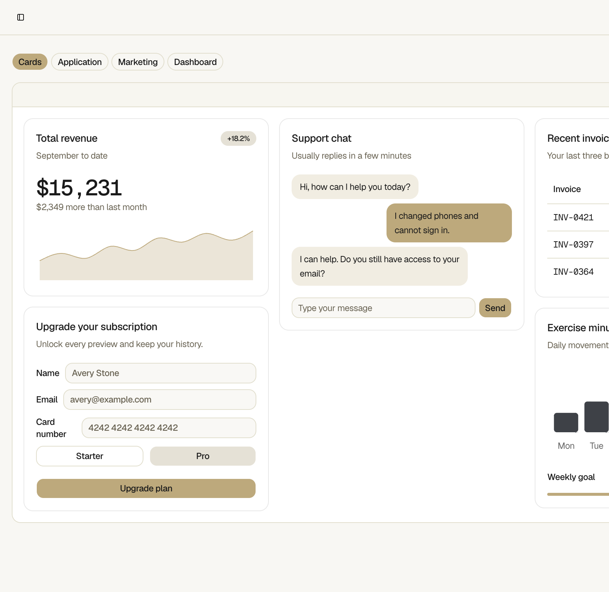
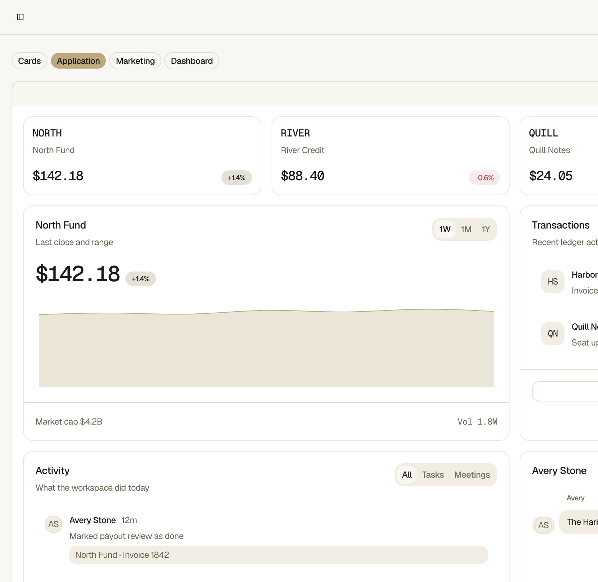
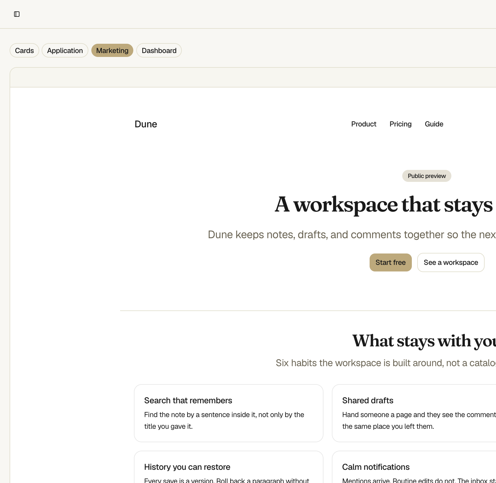
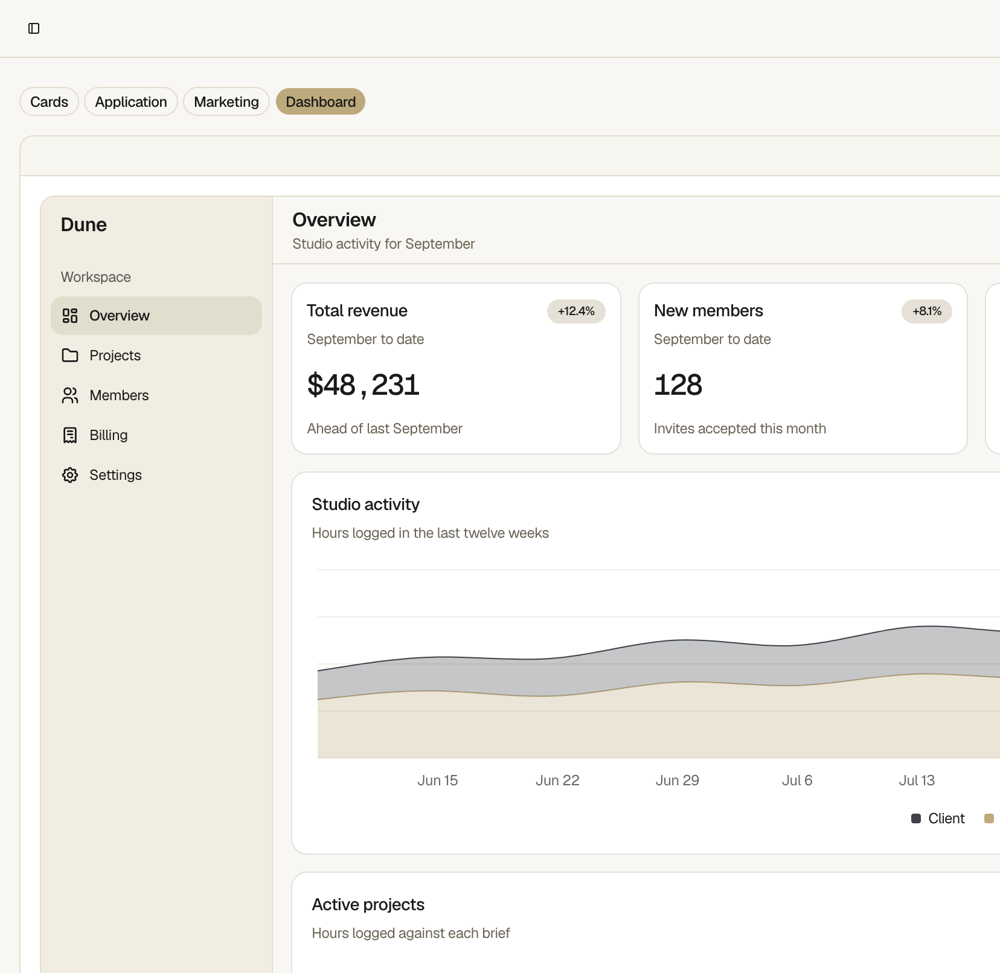
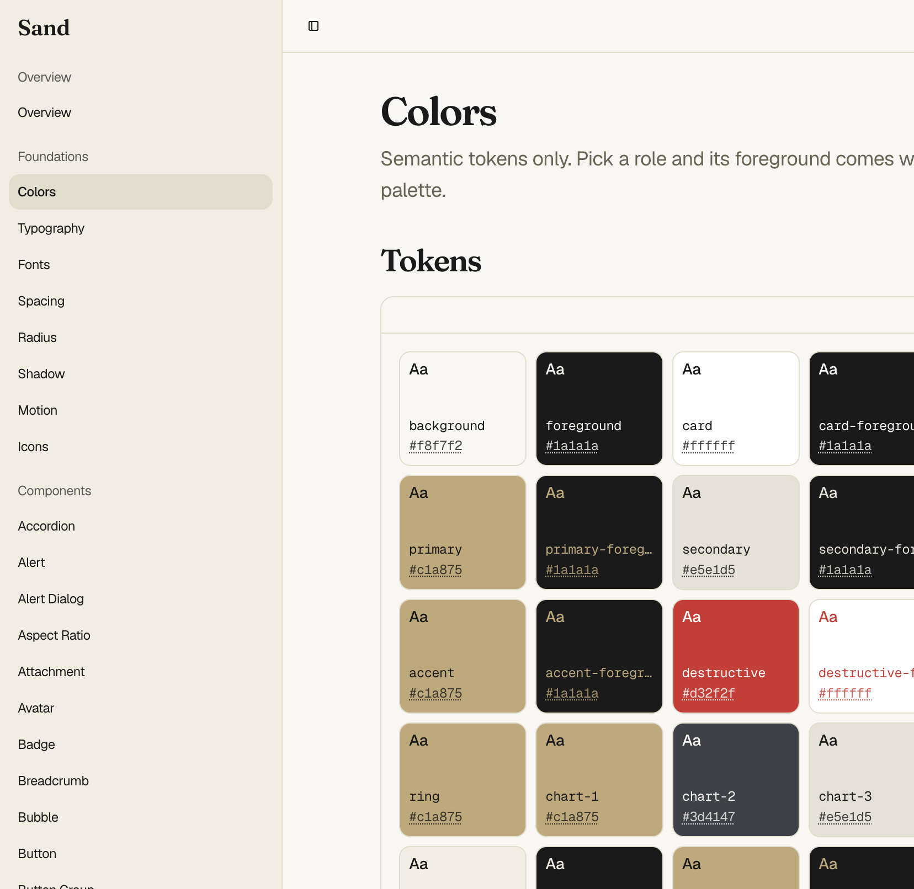
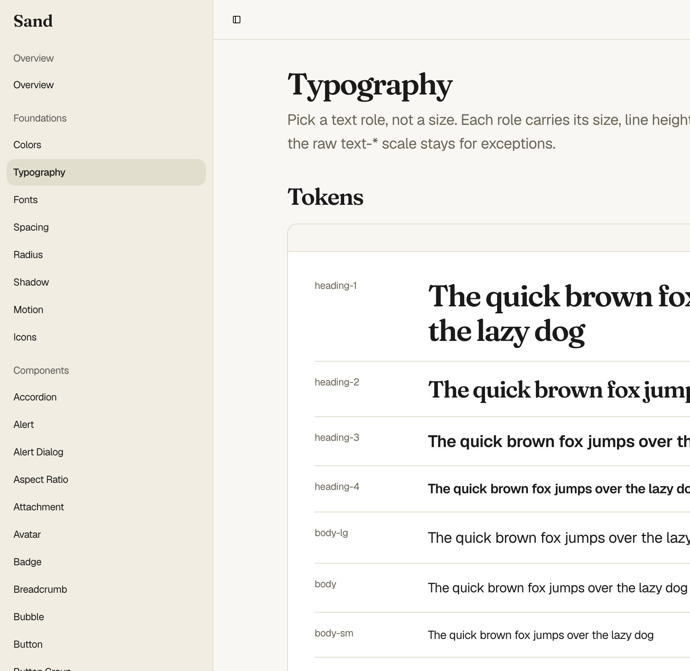

# Sand

A design system for the projects I build, and the docs site that
shows it. Both live in one React + Vite app inside this pnpm
workspace.

Design is the tokens and the rules that bind them, independent of
any library. Mechanics is how this repository realises that design
(React, Vite, Tailwind, the shadcn conventions, Base UI, Tabler,
Recharts, fontsource, tw-animate-css). The docs pages render the
real tokens and components. Four previews compose them into screens
so a change is visible everywhere at once.

```bash
pnpm install
pnpm dev
```

The kanban board under `examples/` imports Sand as a workspace
package, the same shape a consumer uses.

```bash
pnpm kanban
```

## Previews

Cards, Application, Marketing, and Dashboard. Each one is built from
Sand components with hard-coded sample data, so a token or component
change shows up in a real screen.









## Foundations

Tokens rendered live on the docs site.





## How it is used

Pick a semantic token or a component from `sand/`. Rules live in
`sand/rules/` as markdown, one file per topic, and the same text
appears on the matching docs page. Import from the `sand` workspace
package.

The docs site is the first consumer. A project outside this
repository adopts Sand by copying `sand/` at a tagged version into
its own pnpm workspace and owning the copy. Everything under
`sand/` travels, including the docs site, so edits show up there.

## How it is installed

This repository is already a workspace. `pnpm install` from the
root, then the two commands above.

To put Sand in another project, follow
[sand/installation.md](sand/installation.md). The guide covers a
new project (packages, files, workspace entry) and an existing one.
On an existing project the agent lists the changes and waits for
confirmation before acting.

## Layout

- `sand/` - the package a consumer copies. Tokens in
  `src/styles.css`, components in `src/components/ui`, pages in
  `src/pages`, rules in `rules/`
- `examples/` - in-repo apps that import `sand` as a workspace
  package
- `.specs/` - product specs
- `.notes/` - maintainer notes. Reasoning lives here, not on the
  consumer pages
